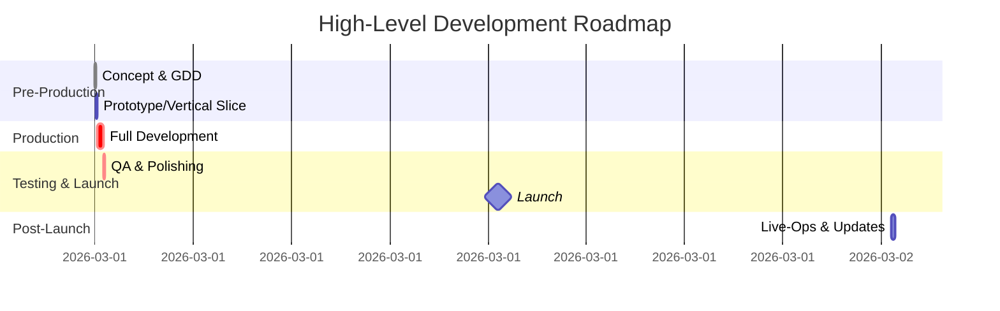

# Designing the Ultimate Collaborative Game: Analytical Research Report

**Executive Summary:** Building the “greatest game” requires balancing broad reach with depth.  We recommend a **multi-platform** approach (PC, consoles, mobile, emerging cloud streaming) using cross-play and scalable tech【24†L162-L170】【90†L130-L134】.  Genre-wise, blend popular mechanics (e.g. action/RPG, puzzle/adventure) in novel ways【38†L128-L137】【39†L100-L104】.  Center on a **strong core loop** (challenge→action→reward) with layered progression (short-term vs long-term goals), informed by player psychology and retention benchmarks【64†L197-L204】【65†L96-L100】.  Rich narrative/worldbuilding (like *Witcher 3* or *Last of Us*) and matching art/audio styles drive immersion.  Monetization should prioritize fairness (purely cosmetic DLC, transparent purchases) and ethics【35†L506-L514】【84†L299-L305】.  Architect on a **cloud-based, microservices** backend (AWS/GCP, Docker/Kubernetes) with robust security【73†L93-L101】【73†L119-L127】.  Use an agile development pipeline with clear roles (design, programming, art, QA, live-ops, marketing) scaled to budget.  Budget plans range from self-funded indies (<$1M) to mid-tier ($1–10M) to AAA ($50–300M+ plus marketing)【48†L185-L189】【84†L299-L305】.  Rigorous QA and live-ops (continuous updates, events) are essential for retention【78†L215-L224】【78†L230-L238】.  Invest early in community building (social platforms, influencer outreach) and legal foundations (IP registration, licensing).  

--- 

## Target Platforms  
- **Best Practices:** Support PC, console, and mobile to maximize audience【24†L162-L170】.  Use engines (Unity, Unreal, Godot) that allow cross-compilation.  Implement cross-progression (shared accounts/cloud saves) so players can switch devices (Fortnite and Minecraft exemplify this【24†L162-L170】).  Plan for the emerging cloud platforms (NVIDIA, Azure) by designing for low-latency streaming and account-based services【53†L1326-L1333】.  
- **Market Context:** PC/console revenue is ~51% of global gaming spend in 2024, mobile ~49%【86†L237-L245】.  Indie devs tend to focus on mobile & desktop (Android, Windows)【90†L130-L134】, while AAA still targets all.  Consider each platform’s strengths: desktop/consoles for high-fidelity gameplay; mobile for accessibility and free-to-play economies; cloud for broad access.  
- **Examples:** *Fortnite* (Epic) and *Minecraft Bedrock* (Microsoft) run on virtually every platform with unified progression【24†L162-L170】. *Genshin Impact* delivers console-quality visuals on mobile【24†L162-L170】.  These multi-platform successes show the importance of broad access.  
- **Trade-offs/Risks:**  Porting wide means more QA/performance testing.  Mobile’s smaller screen and input demands simpler UI and shorter sessions.  Conversely, PC/console players expect deeper mechanics and graphics.  Cloud gaming (e.g. Stadia) still has adoption hurdles (bandwidth, latency).  If the team is small, it may be better to focus initially on 1–2 platforms (most teams start mobile/PC for reach【90†L130-L134】) and expand later.  
- **Recommendation:** Design for cross-platform from the outset: build with a cross-platform engine and abstract platform-specific features.  Prototype on the lowest-spec device to catch UI or performance issues early.  Prioritize platforms by target audience (e.g. mobile & PC first if aiming for mass market) and include a cloud plan (even if just compatible file sizes for streaming).  

## Genres & Hybridization Strategies  
- **Best Practices:** Identify core genres (Action, RPG, Strategy, etc.) and explore hybrid blends to appeal widely【38†L128-L137】.  Each genre has signature loops (shooting in FPS, leveling in RPG, puzzle-solving in puzzle games) – combine ones that complement each other.  For example, add RPG progression to an FPS, or casual puzzle elements to an adventure game.  Hybrid games often attract multiple audiences, but ensure the combination feels cohesive.  Define genre expectations early and build mechanics to satisfy them (e.g. hero shooter mechanics for action games, deck-building for strategy elements).  
- **Genre Comparison:** Below is a comparative table of popular genres and their features:

  | **Genre**          | **Key Features & Loops**                       | **Top Examples**                        |
  | ------------------ | ---------------------------------------------- | --------------------------------------- |
  | **Action/FPS**     | Fast reflex-based combat, multiplayer modes    | *DOOM*, *Call of Duty*, *Overwatch*     |
  | **Action/RPG**     | Combat + character leveling/loot               | *Destiny*, *The Witcher 3*, *Fallout*   |
  | **Role-Playing (RPG)** | Deep story/choices, progression systems       | *Skyrim*, *Mass Effect*, *Persona*      |
  | **Adventure/Narrative** | Exploration, story-driven objectives         | *Last of Us*, *Uncharted*, *Life is Strange* |
  | **Puzzle/Platform**| Logic puzzles, physics challenges, jumping    | *Portal 2*【39†L100-L104】, *Celeste*     |
  | **Strategy (RTS/TBS)** | Resource mgmt, planning, tactics              | *StarCraft*, *Civilization*, *XCOM*     |
  | **Sports/Racing**  | Competitive rules, physics simulation         | *FIFA*, *Gran Turismo*, *Rocket League*【39†L70-L76】 |
  | **Casual/Mobile**  | Simple mechanics, short sessions, social integration | *Candy Crush*, *Among Us*, *Clash Royale* |
  | **Emergent/UGC**   | User-created content, sandbox environments     | *Roblox*, *Minecraft*                   |

- **Examples of Hybrids:** Many successful games mix genres: *Portal 2* combines FPS navigation with puzzles【39†L100-L104】, *Hades* blends roguelike elements with action-RPG combat【39†L113-L118】.  Indie hits like *Undertale* fuse JRPG combat with bullet-hell mechanics【39†L87-L91】, and *Moonlighter* combines hack’n’slash with shopkeeping.  These hybrids kept core loops engaging by layering elements.  
- **Trade-offs/Risks:**  Hybrid games can suffer if one part feels tacked on.  E.g., adding complex RPG stats to a casual mobile game may alienate casual players, while core RPG fans may resist “simplified” mechanics.  Balancing development resources is key: more genres means more systems to test and tune.  Keep the art style and UI consistent; as GameRefinery notes, mismatched styles can confuse players【38†L143-L150】.  
- **Recommendation:** Pick **2–3 genres** that synergize and focus on nailing those loops. Prototype each loop independently first, then integrate. For instance, if doing a “puzzle RPG”, ensure puzzles reward RPG progression. Study top hybrid games (e.g. *Rocket League* as sports+racing【39†L70-L76】) for inspiration.  Use the genre table above to align team skills (e.g. hire a level designer if mixing platforming) and set clear scope on features per genre.

## Core Gameplay Loops  
- **Best Practices:** Design a **clear core loop** of player actions that is fun and repeatable. Typically: **Challenge → Player Action → Feedback/Reward → Progress (upgrades/loot)**.  This loop should be visible and satisfying. Surround it with **mid-term loops** (daily quests, missions) and **long-term loops** (story chapters, endgame goals).  Ensure players quickly grasp the loop via onboarding (tutorials or intuitive design).  Use feedback (visual/sound effects, score popups) to reward each step.  
- **Retention Mechanics:** Address habit formation. The game should offer reasons to return each session (daily rewards, new content). Balance immediate gratification (points, level-ups) with long-term goals (story completion, high scores). Track and optimize funnel metrics (day-1, day-7 retention) to find dropout points.  
- **Examples:** In *Portal 2*, the loop is “solve a puzzle (using portals) → advance to next level → enjoy story payoffs”【39†L100-L104】. In *Hades*, it’s “attempt underworld run → fail or win → gain resources/upgrades → try again”【39†L113-L118】.  Battle royale games like *Fortnite* use “drop/play match→earn XP/loot→improve character →drop again”.  These examples layer short loops (gunplay, puzzles) with longer loops (progression over seasons).  
- **Psychology:** Leverage intrinsic motivators: mastery (skill challenge), autonomy (choices of playstyle), and relatedness (social features). Provide clear goals (like achievements) and unpredictable rewards (loot drops) to trigger dopamine. Avoid frustration: ensure difficulty curve is tuned and communicates success chances.  For example, gacha-like systems should avoid predatorily low odds【35†L506-L514】.  
- 【11†embed_image】 *Figure: A typical player retention funnel illustrating how Day-1 retention feeds into later engagement. Strong initial retention (top of funnel) is crucial; benchmarks are ~30% Day-1, ~10% Day-7, ~5% Day-30【65†L96-L100】.*  Monitor these KPIs using game analytics (e.g. GameAnalytics, Unity Analytics) to refine loops.  
- **Trade-offs/Risks:**  Overly simple loops (button-mashing) may bore players; overly complex loops may intimidate.  Grind-heavy loops can increase short-term retention (people grind to see more content) but cause burnout.  Using powerful upsells (e.g. pay-to-win upgrades) often hurts loop satisfaction and is generally discouraged.  Conversely, too shallow a loop may fail to engage core players.  
- **Recommendation:** Prototype the loop quickly and test it internally. Use split-tests to experiment with pacing (e.g. XP curve, drop rates). Include iterative feedback checkpoints. Reward players often at first (to hook them) and spread out rewards later (to retain long-term). Integrate community features (leaderboards, co-op) to make the loop social.  

## Player Psychology & Retention Mechanics  
- **Metrics:** Focus on **DAU/MAU ratio** (stickiness) and retention at key milestones (Day 1, Day 7, Day 30)【64†L197-L204】【65†L96-L100】.  Industry benchmarks (mobile games) are ~30% Day-1, ~10–12% Day-7, ~3–5% Day-30【65†L96-L100】.  Track session length and session count to gauge engagement【64†L206-L214】.  Aim for low churn by identifying and addressing early drop-offs.  
- **Engagement Tricks:** Implement daily/weekly objectives and a reward calendar. Use push notifications wisely to draw players back for new content. Incorporate social hooks: guilds, co-op missions, PvP matches, and friend leaderboards can leverage relatedness.  Offer “freebies” (gifts, login bonuses) to spike retention, but ensure core gameplay is enjoyable on its own.  
- **Psychological Triggers:** Utilize **progress feedback** (XP bars, leveling up) to tap into competence. Create moments of **flow** by balancing challenge and skill. Include **narrative rewards** (new story bits) and **collectibles/achievements** for completionists. Provide **autonomy** via skill trees or character customization. Avoid mechanics that cause anxiety or frustration (e.g. extremely punishing failure states).  
- **Examples:**  *Candy Crush Saga* keeps users returning with daily lives/boosters and social lives to share【78†L249-L257】.  *Fortnite’s* Battle Pass offers gated rewards for daily play and challenges.  Successful mobile RPGs give login streaks and timed dailies.  
- **Trade-offs/Risks:**  Aggressive retention tactics (nagging pop-ups, fear-of-missing-out events) can annoy players.  Accessibility vs depth: highly rewarding loops should not gate off core gameplay.  Ethical lines: loot boxes and manipulative sales funnels can backfire (and even invite regulation).  
- **Recommendation:** Design retention around **value**, not manipulation. Ensure daily incentives feel like a bonus, not punishment for absence. Regularly review analytics; if retention dips, adjust early gameplay or difficulty.  Use A/B tests for features like notifications, on-boarding tutorials, and reward structures.  Monitor player sentiment on forums to catch frustration points early.

## Narrative & Worldbuilding  
- **Best Practices:** Build a **cohesive universe**. Align story and world to game theme (e.g. a whimsical world for a fantasy game, a dystopian tone for sci-fi). Use **environment storytelling** (backstory in level design, audio logs) and strong characterization. Plan lore (history, factions, rules) that supports gameplay. Write narrative to enhance, not overshadow, the game: story should motivate gameplay objectives.  
- **Examples:**  *The Witcher 3* and *Skyrim* set high bars with rich lore and branching quests. *Dark Souls* conveys story indirectly through atmosphere and item descriptions.  Indie example: *Disco Elysium* is celebrated for dense narrative on a minimal budget.  Games like *Portal* and *Half-Life* blend minimalistic storytelling seamlessly into gameplay.  
- **Narrative Techniques:** Consider linear vs open-world storytelling. Linear narratives (a set campaign) allow tight pacing and emotional arcs. Open-world games require more ambient story and flexible structure. Incorporate player choice where possible (moral choices, branching quests) to increase investment. Leverage voice acting and quality writing to bolster immersion.  
- **Trade-offs/Risks:**  Heavy narrative demands writing talent and can lengthen development. Over-narration can slow down action; under-narration may leave world feeling empty.  Localizing a rich narrative adds cost.  For global games, some nuance may be lost in translation.  
- **Recommendation:** If aiming for “greatest”, invest in worldbuilding early. Craft a “story bible” for consistency. Use narrative to reinforce player agency (e.g. let choices change outcomes). Even if narrative is secondary to gameplay, ensure the world feels alive (ambient sounds, thematic music). For multiplayer or live-service games, use story-driven events or lore updates to keep content fresh.

## Art and Audio Direction  
- **Best Practices:** Choose an art style that fits and endures. Stylized graphics (2D pixel, cel-shaded, low-poly) can stand the test of time and perform well cross-platform. Photorealistic 3D is resource-intensive but appeals to AAA audiences. Define visual language (palette, level of realism) early. Ensure consistent UI/UX design that matches the game’s tone【70†L0-L3】.  
- **Audio:** Compose a soundtrack that matches the mood (e.g. epic orchestral for adventure, synth/dark ambient for horror). Use dynamic audio cues to reflect gameplay (intensifying music in battle, spatial sound for immersion). Implement voice acting for characters to deepen narrative.  
- **Examples:**  *Cuphead*’s hand-drawn 1930s cartoon style and jazzy soundtrack received acclaim. *Overwatch* uses vibrant colors and a heroic score to match its heroic shooter theme. *The Witcher 3* features lush orchestral music and detailed visuals that earned it an Oscar soundtrack.  Indie games (*Hollow Knight*, *Undertale*) prove that strong art/audio can elevate even small projects.  
- **Trade-offs/Risks:**  High-end graphics and sound can blow budgets. They require powerful hardware (limiting platforms). Minimalist or retro styles can cut cost but may narrow appeal.  Poor audio (muffled voice, looping tracks) breaks immersion.  
- **Recommendation:** Align art style with budget and audience. For broad appeal, consider a slightly stylized look that ages well. Invest in at least one talented concept artist and composer. Plan for accessibility (colorblind modes, subtitles). If resources permit, use middleware (e.g. Wwise for audio) and optimization techniques. In marketing, show your game’s visual and audio uniqueness.

## Monetization Models (Ethical)  
- **Best Practices:** Adopt models where the base game is fun without spending, and purchases are optional enhancements (cosmetics, expansions). **Free-to-play (F2P)** can reach many users, but use only non-intrusive IAP (skins, battle passes) and fair progression (avoid pay-to-win). **Premium** (one-time purchase) works for story-driven/console games and builds goodwill. Consider subscriptions or season passes if appropriate (e.g. multiplayer/live-service games).  Any microtransaction must be transparent (show odds for gacha) and comply with regulations.  
- **Examples:**  *Fortnite* and *DOTA2* use purely cosmetic microtransactions (skins, emotes) and earn billions without affecting gameplay.  *League of Legends* and *Overwatch* also use cosmetic DLC ethically.  Conversely, *Genshin Impact* uses gacha (random draws), which has generated huge revenue but drawn ethical scrutiny【35†L506-L514】.  Mobile games often mix ads and small IAP; globally, mobile IAP is ~50% of gaming revenue【28†L1597-L1602】, with ads ~20%【30†L1638-L1641】.  AAA titles today may charge $60–70 upfront, with some offering post-launch DLC instead of randomized boxes【28†L1574-L1582】.  
- **Revenue Split:**  Mobile (free) games typically earn ~70–80% from IAP and ~20% from ads【30†L1638-L1641】.  PC/console rely more on direct purchases and DLC.  Overall, about half of global gaming revenue comes from mobile IAP【28†L1506-L1508】.  (See embedded chart for a sample monetization mix.)  
- 【16†embed_image】 *Figure: Example monetization breakdown for a mobile F2P game: majority via in-app purchases (IAP), with ads and other streams making up the rest【28†L1597-L1602】【84†L299-L305】.*  
- **Ethical Considerations:**  Aim for fairness – free players should not be at a disadvantage to paying ones.  Avoid gambling-like systems: loot boxes or heavy gacha can lead to addiction and are under regulatory scrutiny.  Data from surveys shows most players (82%) will spend on IAP if the value is clear【35†L535-L542】, so focus on clear value-adds (cosmetic packs, expansion stories).  Use parental controls and low-price items for younger audiences.  
- **Trade-offs/Risks:**  F2P games require constant content updates (live-ops) to keep revenue flowing. Premium games risk lower sales volume.  Aggressive monetization can lead to user backlash or harm retention.  Pricing too high can reduce sales (BCG notes ~45% of fans will pay more for premium games, while ~30% resist any increase【28†L1574-L1582】).  Also account for platform fees (app store cuts).  
- **Recommendation:** Choose a primary model (F2P or Premium) based on target audience. If F2P: emphasize purely cosmetic or convenience items, and avoid pay-to-win. For premium: consider post-launch expansions or cosmetic DLC. Always test user willingness to pay (e.g. concept art, surveys). Keep economics transparent to maintain goodwill (publish patch notes and be honest about drop rates).  

## Technical Architecture & Scalable Backend  
- **Best Practices:** Use a **cloud-native, microservices** backend to handle scale.  Critical components include authentication/account service, matchmaking, leaderboards, and game servers.  Employ **dedicated game servers** (host authoritative instances for matches) to ensure fairness【73†L67-L76】.  Utilize load balancers to distribute traffic and auto-scaling on demand【73†L67-L76】. Containerize services (Docker/Kubernetes) for ease of deployment and scaling【73†L93-L101】.  Use low-latency databases (NoSQL) for player data and analytics, and CDN networks for patch/asset delivery.  Implement robust analytics pipelines to track KPIs in real-time.  
- **Security:** Encrypt client-server communications (TLS) and validate game logic on server to prevent cheats【73†L119-L127】.  Use anti-cheat solutions or server-side checks for competitive integrity.  Regularly audit for vulnerabilities. Use OAuth or similar for user accounts, and separate permissions for different services.  
- **Technology Stack:**  Common choices: engines like Unity/Unreal for client.  Cloud providers: AWS (GameLift, Lambda), Google Cloud, or Azure (PlayFab).  Databases: Redis for caching, MongoDB/Azure Cosmos for player stats, SQL for transactions.  Tools: Jenkins/GitHub Actions for CI/CD; Slack/Discord for ops alerts; and analytics tools (GameAnalytics, Adjust).  
- **Examples:**  *Fortnite* runs on AWS and scales thousands of game servers per match.  *Roblox* lets players build UGC experiences on its own cloud backend (1.6M monetized creators, showing scale【53†L1417-L1424】).  Many startups use Firebase or PlayFab to avoid building their own backend.  
- **Trade-offs/Risks:**  Complex backends require DevOps expertise and cost.  Overengineering early can waste resources if user base is small.  Single points of failure (e.g. one database) can crash the game.  Platform lock-in (e.g. relying on a single cloud vendor) is a risk but often worth the scalability.  
- **Recommendation:** Start with a hybrid approach: use managed services (e.g. AWS GameLift or Photon for real-time servers) and cloud databases, then iterate into microservices as needed.  Prepare for spike scaling (launch events, promotions).  Invest in monitoring (Datadog/NewRelic) and set up alerts for server health.  Prioritize latency-critical services (matchmaking, combat) for optimization.  

## Development Pipeline & Team Roles  
- **Pipeline:** Follow an **iterative, Agile** process.  Key phases: concept/requirements → prototyping (vertical slice) → full production (engine and content development) → testing/QA → launch → live-ops.  Use version control (Git/Perforce) and continuous integration to catch issues early.  Incorporate frequent playtesting and feedback cycles.  
- **Roles & Teams:**  Scale the team to your budget. Typical roles include: designers (game, level, narrative), programmers (gameplay, engine, network, tools), artists (concept, 2D/3D, animation, UI), audio engineers, QA testers, producers/PMs, and live-ops/community managers.  Larger projects have specialists (UX designers, technical artists, audio composers); smaller indies have multi-role generalists.  Refer to the table below for a rough breakdown by studio size:

  | **Role**           | **Indie (1–5 ppl)**           | **Mid (10–50 ppl)**             | **AAA (100+ ppl)**                    |
  | ------------------ | ---------------------------- | ------------------------------ | ------------------------------------ |
  | *Project Lead*     | Lead dev/founder             | Producer/Creative Director     | Multiple Producers/Directors         |
  | *Design*           | 1-2 generalists             | Teams for game/level/world/narrative design | Large design dept + writers       |
  | *Programming*      | Few multi-skilled devs       | Specialists (gameplay, engine, network, tools) | Multiple engineering teams (AI, graphics, systems) |
  | *Art*              | Artist generalist (2D/3D/UI) | Concept, environment, character, VFX artists | Large art department (multiple teams for characters, environments, UI, VFX) |
  | *Audio*            | Outsourced or composer       | Dedicated composer & sound designers | Full audio team (score, SFX, voice teams) |
  | *QA/Testing*       | Founder-led or outsourced    | Small internal QA or outsourced testhouses | Dedicated QA department (hundreds of testers) |
  | *Live-Ops/Community* | Developer(s) handle it     | 1-2 people (ops manager, community manager) | Team for live content, events, social media |
  | *Marketing/PR*     | Founder/social media presence | Marketing lead/agency        | Large marketing/PR department + agencies |
  | *Legal/IP*         | Consultant/legal firm as needed | In-house counsel or publisher legal dept | Full legal/IP team                |

- **Industry Insight:**  Surveys indicate over half of studios self-fund smaller projects【48†L215-L218】.  Indie teams commonly use Unity/Godot (open source is rising) while mid/AAA often use Unity or Unreal for high-end graphics【75†L119-L127】.  JetBrains notes Unity leads among indies, with Godot growing in popularity【75†L119-L127】.   
- **Trade-offs/Risks:**  Big teams enable parallel work but increase communication overhead and delays (Brook’s Law).  Small teams move fast but risk burnout and limited skill coverage (e.g. no dedicated QA can lead to bugs).  Outsourcing can save cost but may reduce creative control.  Freelancer turnover can disrupt schedules.  
- **Recommendation:** Begin with a core team covering essential disciplines.  Clearly define each role’s responsibilities.  Use project management tools (Jira, Asana) to track tasks.  Outsource non-core tasks (e.g. asset art, localization) to stretch budget.  Maintain a healthy dev pipeline with buffers for iteration (a 20% time buffer in schedules is common).  

## Production Timeline & Budget  
- **Timelines:** Typical development durations vary by scope:  
  - **Mobile/Casual:** ~3–12 months (e.g. *Candy Crush* took ~1 year【46†L324-L332】).  
  - **Mid-Tier:** ~1–2 years for 3D or moderately complex games.  
  - **AAA:** 3–7+ years (e.g. *RDR2* took ~8 years【46†L349-L358】).  Use milestones (pre-alpha, alpha, beta) to structure development.  
- **Budgets:** Ranges by category:  
  - **Indie/Low-Budget:** <$50K–$2M (often self-funded【48†L185-L189】).  Example: *Stardew Valley* (~$1.3M budget).  
  - **Mid-Budget (AA):** ~$5–20M for high-quality mid-sized games.  *A Plague Tale: Innocence* (~$6M–$9M estimated).  
  - **AAA:** Typically $50M–$200M+ development costs.  Koster notes most games cost < $50M, but blockbusters can exceed $100M【84†L262-L270】【84†L272-L279】.  Excluding marketing, A-list PC/console titles often reach $100–300M.  (Note: marketing costs can double this【84†L299-L305】.)  
- **Budget Breakdowns:**  A rule of thumb is dev cost vs marketing: AAA games often spend ~100% of dev cost on marketing【84†L299-L305】.  Mobile games may spend 3–10× dev budget on user acquisition【84†L299-L305】.  See table for rough allocation:

  | **Budget Tier** | **Dev Cost (USD)**   | **Marketing / Ops**                 | **Examples**                   |
  | --------------- | -------------------- | ---------------------------------- | ------------------------------ |
  | Indie           | <$50K–$1M            | Minimal/word-of-mouth              | *Celeste*, *Hollow Knight*     |
  | Mid (~AA)       | $5M–$20M             | 50–100% of dev cost on marketing   | *A Plague Tale*, *Life Is Strange* |
  | AAA             | $50M–$150M+          | ~100% or more of dev cost          | *Witcher 3*, *Cyberpunk 2077*  |

- **Trade-offs/Risks:**  Short budgets force feature cuts; overly optimistic budgets lead to crunch or canceled features.  Underestimating QA or marketing (especially user acquisition in mobile) often dooms projects.  Feature creep is a major risk – stick to the MVP feature set.  According to Koster, the “median” game cost is lower than headline budgets【84†L299-L305】, but high-end features (AAA) push budgets exponentially.  
- **Recommendation:** Draft a detailed budget breakdown early (staff salaries, software, servers, marketing, etc.).  Use the estimates above as a starting point and scale to your game’s scope.  Include at least 20% contingency.  For a collaborative team, decide on target tier (indie vs AAA) and allocate accordingly.  Secure funding or set realistic self-funding limits.  Plan milestones and tie releases to cost.  

## QA & Live-Ops Strategies  
- **QA Practices:** Integrate QA throughout dev. Use unit tests and automated regression tests for key systems. Conduct platform certification testing (especially for consoles) late in development. Hire dedicated testers or contract test labs for systematic bug hunting. Maintain bug-tracking (JIRA/Redmine) and fix critical issues before new features.  
- **Live-Ops (Post-Release):** Plan for continuous post-launch support. Schedule regular content drops (events, levels, items) to keep the game fresh【78†L250-L257】. Use player feedback channels (forums, social media) to identify issues. Release patches/hotfixes quickly when bugs arise【78†L215-L224】. Track metrics (churn rate, ARPU) to evaluate live updates’ effectiveness.  
- **Examples:**  *Fortnite*, *Candy Crush*, and *Minecraft* pioneered “games as services”: frequent updates and live events【78†L193-L202】.  For instance, Fortnite’s seasonal updates and events have maintained player interest for years【78†L193-L202】.  Mobile games often run daily events and social competitions.  
- **Trade-offs/Risks:**  Live-ops demands dedicated team and ongoing budget.  Overdoing events can fatigue players.  Conversely, neglecting post-launch support often leads to rapid decline.  QA must balance delay vs quality – a late fix of a major bug can be game-saving but may push schedules.  
- **Recommendation:** Hire or assign a small live-ops team early (designers + devs) to plan updates.  Use analytics (heatmaps, funnels) to find gameplay bottlenecks and address them.  Maintain transparent communication: announce patch notes and future plans to build trust.  Remember that Live-Ops can greatly extend a game’s lifespan and profitability.

## Community Building & Marketing  
- **Best Practices:** Engage players before launch through teasers, social media, developer blogs, and influencer demos. Build an official community hub (Discord, Reddit) and encourage user-created content (mods, maps) to deepen engagement. Support multiplayer aspects with ranked modes, leaderboards, and eSports/events where applicable. Post-launch, foster community by spotlighting fan creations and running contests or beta tests.  
- **Examples:**  Successful games often have strong communities: *Roblox* has 1.6M creators monetizing their games【53†L1417-L1424】, and *Minecraft* thrives on UGC.  Indie *Celeste* grew via word-of-mouth and social media before launch.  Kickstarted games often use backer communities for promotion.  AAA titles like *Overwatch* and *Valorant* invested in eSports from day one.  
- **Monetization Note:** A dedicated community can amplify revenue (via user referrals, DLC sales).  BCG notes top mobile games with strong live-ops generally earn more【28†L1638-L1641】.  
- **Trade-offs/Risks:**  Community management is time-consuming. Negative feedback can spread quickly if issues aren’t addressed.  Overhyping features can backfire (see “No Man’s Sky” launch).  Marketing budgets must match game scale: big AAA campaigns need millions.  
- **Recommendation:** Start marketing early with a "soft launch" region or closed beta to test the game. Use data-driven user acquisition (Facebook Ads, Google UAC). Collect metrics on player acquisition cost (CPA) vs lifetime value (LTV) to adjust spend. After launch, keep content pipeline and community channels active to retain interest.  

## Legal & IP Considerations  
- **Best Practices:** Secure all intellectual property rights. Ensure all team contracts assign game IP to the studio or publisher. Trademark the game name/logo to protect brand. Copyright original assets (code, art, story). Use licensed engines (Unity, Unreal) according to their terms. For user-generated content, clearly define ownership (e.g. *Roblox*’s creator monetization is a model). Always follow privacy laws (e.g. COPPA for kids games, GDPR).  
- **Industry Insight:** As BCG notes, copyright/IP issues are a growing concern especially with AI and user content【53†L1278-L1286】.  Treat IP proactively: register in key markets, and plan for enforcement.  
- **Trade-offs/Risks:**  Legal fees add cost but avoid costly future litigation.  Overly restrictive IP policies can stifle community creativity (consider fair use for fan art).  Export regulations or patent issues may arise with new tech (e.g. VR hardware patents).  
- **Recommendation:** Consult a legal expert early to handle contracts and compliance. Draft a clear EULA/Terms of Service. Use existing templates (IGDA/FASE guidelines) as a starting point. Plan for localization and rating requirements (ESRB, PEGI) in target regions.

---

## Next Steps and KPIs

1. **Validate the core design:** Build a prototype of the core gameplay loop. Playtest internally to ensure it’s fun.  Collect early feedback on mechanics and pacing.  
2. **Define scope and platform:** Confirm target platforms and main genre mix.  Use [86†L237-L245] and [90†L130-L134] data to prioritize (e.g. mobile + PC first).  
3. **Choose technology stack:** Evaluate engines (Unity, Unreal, Godot) and backend services (AWS GameLift, Firebase, PlayFab). JetBrains data suggests **Unity/Godot** are indie favorites【75†L119-L127】. Select analytics (GameAnalytics) and CI/CD tools (Jenkins/GitHub Actions).  
4. **Assemble core team:** Assign roles based on our table. Recruit key leads (e.g. technical director, lead designer, art director). Start cross-training: ensure at least 1 person covers each major discipline.  
5. **Set up infrastructure:** Provision dev environment, version control, bug tracker. Configure initial analytics to track DAU, retention, ARPDAU from Day 1.  
6. **Plan MVP and budget:** Finalize minimum feature set and timeline. Use the above budget ranges【84†L299-L305】【48†L185-L189】 to set realistic funding needs. Allocate marketing spend in advance (equal to dev cost for big launches【84†L299-L305】).  
7. **Establish metrics:** Define KPIs (Day-1/7 retention, DAU/MAU, session length, conversion rates, ARPU). Use dashboards to monitor funnel drop-off【64†L197-L204】【65†L96-L100】.  
8. **Prototype monetization:** If F2P, set up a simple in-app purchase flow (cosmetics or boosts) and test user response. Ensure storefront complies with platform rules.  
9. **Community & Marketing Prep:** Create a landing page and social channels. Release teasers/survey to gauge interest. Plan for a closed beta to gather feedback and build an initial player base.  
10. **Legal review:** Register necessary copyrights/trademarks and draft contracts. Ensure compliance with data and content laws before launch.

By following these steps with the outlined design and business strategies, the team (including Claude Code) will be positioned to create a compelling, scalable game. Success metrics should be monitored continuously to guide iteration, ensuring the final game meets player expectations and achieves sustainability.  

